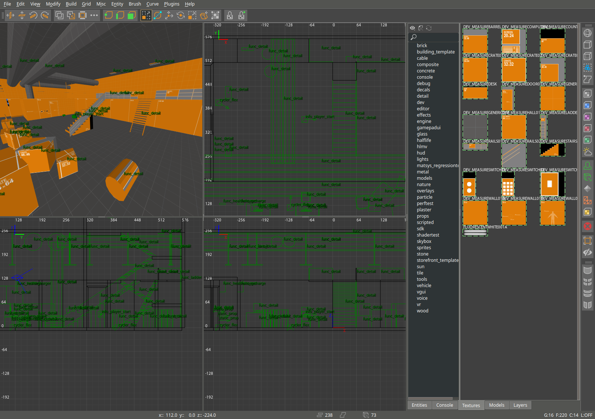

SourceRadiant
=================

The open-source, cross-platform level editor for Source Engine based games.

SourceRadiant is a fork of NetRadiant-custom (GtkRadiant 1.4&rarr;massive rewrite&rarr;1.5&rarr;NetRadiant&rarr;[NetRadiant-custom](https://github.com/Garux/netradiant-custom)&rarr;this)

SourceRadiant makes heavy use of the [sourcepp](https://github.com/craftablescience/sourcepp) library.

---

---

## Supported games

Main focus is on Half-Life 2.

## Features

Development is focused on smoothing and tweaking editing process.

#### Random feature highlights

* WASD camera binds
* Fully supported editing in 3D view (brush and entity creation, all manipulating tools)
* Uniform merge algorithm, merging selected brushes, components and clipper points
* Free and robust vertex editing, also providing abilities to remove and insert vertices
* UV Tool (edits texture alignment of selected face or patch)
* Autocaulk
* Model browser
* Brush faces extrusion
* Left mouse button click tunnel selector, paint selector
* Numerous mouse shortcuts (see help->General->Mouse Shortcuts)
* Focus camera on selected (Tab)
* Snapped modes of manipulators
* Draggable renderable transform origin for manipulators
* Quick vertices drag / brush faces shear shortcut
* Simple shader editor
* Texture painting by drag
* Seamless brush face<->face, patch<->face texture paste
* Customizable keyboard shortcuts
* Customizable GUI themes, fonts
* MeshTex plugin
* Patch thicken
* All patch prefabs are created aligned to active projection
* Filters toolbar with extra functions on right mouse button click
* Viewports zoom in to mouse pointer
* \'all Supported formats\' default option in open dialogs
* Opening *.map, sent via cmd line (can assign *.map files in OS to be opened with radiant)
* Texture browser: show alpha transparency option
* Texture browser: search in directories and tags trees
* Texture browser: search in currently shown textures
* CSG Tool (aka shell modifier)
* Working region compilations (build a map with region enabled = compile regioned part only)
* QE tool in a component mode: perform drag w/o hitting any handle too
* Map info dialog: + Total patches, Ingame entities, Group entities, Ingame group entities counts
* Connected entities selector/walker
* Build->customize: list available build variables
* 50x faster light radius rendering
* Light power is adjustable by mouse drag
* Anisotropic textures filtering
* Optional MSAA in viewports
* New very fast entity names rendering system
* Support \'stupid quake bug\'
* Arbitrary texture projections for brushes and curves
* Fully working texture lock, supporting any affine transformation
* Texture locking during vertex and edge manipulations
* Brush resize (QE tool): reduce selected faces amount to most wanted ones
* Support brush formats, as toggleable preference: Axial projection, Brush primitives, Valve 220
* Autodetect brush type on map opening
* Automatic AP, BP and Valve220 brush types conversion on map Import and Paste
* New bbox styled manipulator, allowing any affine transform (move, rotate, scale, skew)
* rendering of Q3 shader based skyboxes
* Incredible number of fixes and options

## [COMPILING](COMPILING.md)
